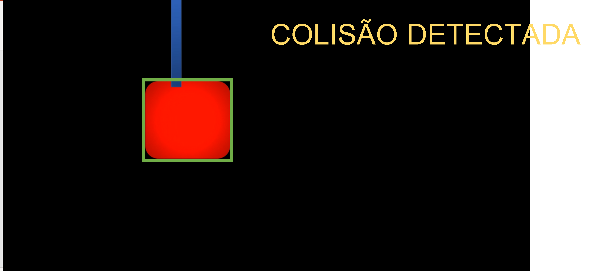

## Questão 2 

Você deve fazer um programa que detecta a colisão entre as formas geométricas. 


### Orientações

Você vai trabalhar no arquivo `q2/q2.py`. com o vídeo `q2A.mp4` ou `q2B.mp4`que já estão no diretório.

O vídeo para prova tem como base a soma de todos os dígitos do RM de todos os componentes do grupo:

|Soma RM | Video|
|--------|------| 
|De 1 até 5 | q1A|
|De 6 até 9 | q1B|

Exemplo: RM090174,RM0224,.. = 0+9+0+1+7+4 + 0+2+2+4... = 29=> 2+9 = 11 => 1+1 = 2 usar o víideo q1A

### como executar seu código


Para executar os testes localmente (em sua maquina). No CMD/terminal **`dentro do diretorio do seu projeto`** digite:

```bash
python q2.py
``` 

Dica: 

    - Se aparecer não rodar o código e aparecer a mensagem parecida com: `OpenCV: Couldn't read video stream from file "q2A.mp4"`significa que você não está no diretório correto da questão q2. 
    - Lembre-se de estar com venv ativada para rodar o código. isso garante que as libs estão instaladas corretamente.

### O que você deve fazer:

Fazer o programa que devolve um output visual de acordo com a rubrica. 

Atenção: Não pode usar Template Matching, Feature Detection, Machine Learing ou Deep Learning, use os conceitos vistos em aula até o momento.


### Rubrica

O que é esperado para cada rubrica:

|Resultado| Conceito| 
|----------|--------|
|R0 – Não executa | 0 |
|R1 – Detecta todas as formas geométrica por cor e produz saída visual demonstrando | 1 |
|R2 – Identifica a forma geométrica de maior massa com um retângulo verde em output visual | 2 |
|R3 – Detecta colisão entre as formas geométricas e identifica escrevendo no output visual “COLISÃO DETECTADA” | 4 |
|R4 – Identifica e exibe que a forma geométrica de maior massa ultrapassou completamente a outra forma geométrica | 5 |

Casos intermediários ou omissos da rubrica serão decididos pelo professor.

#### Dica: 

Seja organizado, estruture seu código por funções para facilitar o desenvolvimento.

É esperado como output visual para a R1/R2, a detecção dos contornos dos objetos.


É esperado como output visual para a R3, resultado da detecção de colisão.




É esperado como output visual para a R4, resultado indicando que ultrapassou a barreira .


Se você precisar gerar mais de uma imagem de `debug` para demonstrar como seu programa funciona, as exiba usando a função `cv2.imshow`.
